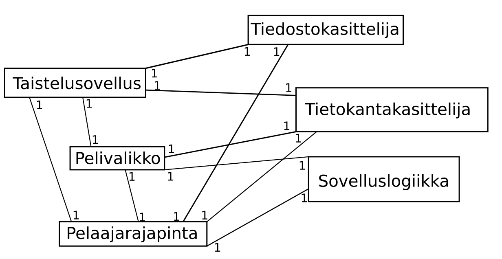
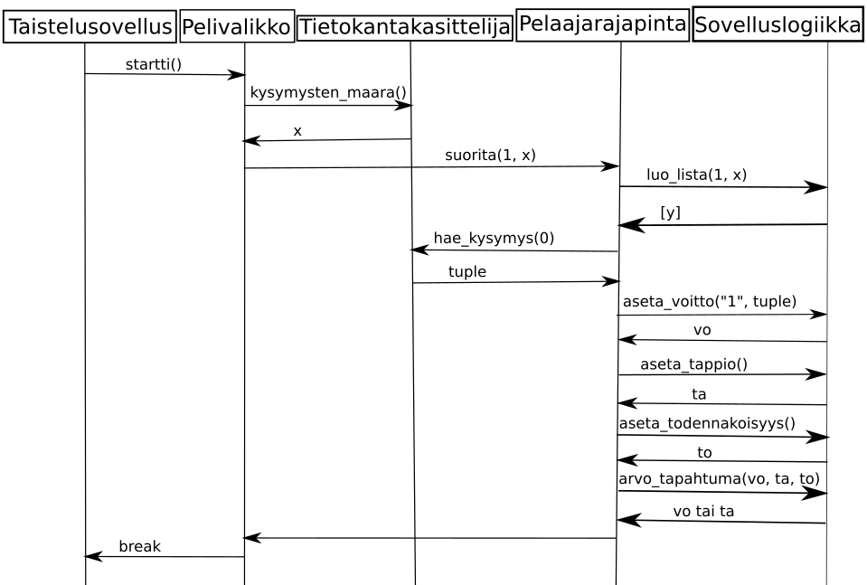

# Arkkitehtuurikuvaus

## Rakenne

### Luokkakaavio

## Päätoiminnallisuudet
#### Uusi peli alusta loppuun (yksi kysymys, ei pelin tallentamista)

Huom. x, y ja to ovat kokonaislukuja suljetulta väliltä 1-100. Tuple on pythonin tuple rakenne, ja vo ja ta ovat merkkijonoja.
