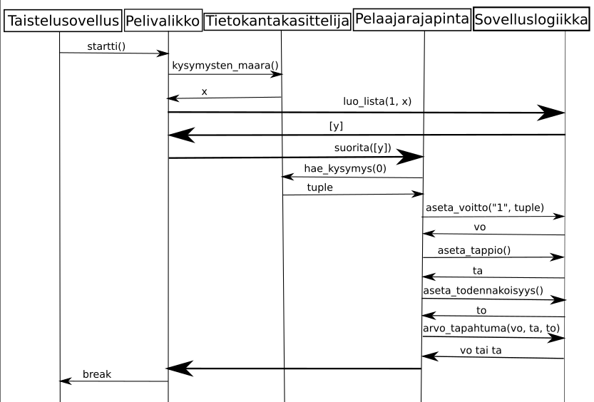

# Arkkitehtuurikuvaus

## Rakenne
Sovelluksen rakenne noudattaa seuraavaa luokkakaaviota.

Luokkia on yritetty järjestää omiin hakemistoihin, mutta luokkien moduulista toiseen tuomiseen liittyvien ongelmien vuoksi tästä on luovuttu.

## Käyttöliittymä
Käyttöliittymään kuuluu seuraavat kolme näkymää:
* Alkuvalikko (toteutettu luokkana Taistelusovellus)
* Uuden pelin valmistelu (toteutettu luokkana Pelivalikko)
* Itse pelin pelaaminen (toteutettu luokkana Pelaajarajapinta)

## Sovelluslogiikka
Sovelluksen sisäinen logiikka on toteutettu luokkana Sovelluslogiikka, johon kuuluvat seuraavat metodit:
* 'luo-lista', joka luo satunnaisen listan kysymyksiä uuden pelin aloittamiseksi listan.
* 'aseta-voitto', 'aseta-tappio' ja 'aseta-todennakoisyys', jotka nimensä mukaisesti asettavat voiton, tappion ja todennäköisyyden seuraava metodia varten.
* 'arvo-tapahtuma' palauttaa annetun todennäköisyyden mukaan satunnaisesti voiton tai tappion.

## Pysyväistallennus
Sovelluksessa käytettävät kysymykset tietoineen tallennetaan tietokannan kysymykset.db tauluun Kysymyksia, mistä vastaa luokka Tietokantakasittelija.
Tauluun on valmiiksi tallennettuna testikysymys, jonka voi vapaasti poistaa SQLite-tulkilla, kunhan sen korvaa välittömästi jollain muulla kysymyksellä.

Tallennettu peli on tallennettuna tekstitiedostoon pelitallennus.txt. Luokka Tiedostokasittelija vastaa pelin tallentamisesta ja lataamisesta.

## Päätoiminnallisuudet
### Uusi peli alusta loppuun (yksi kysymys, ei pelin tallentamista)

Huom. x, y ja to ovat kokonaislukuja suljetulta väliltä 1-100. Tuple on pythonin tuple rakenne, ja vo ja ta ovat merkkijonoja.

Luokka Taistelusovellus kutsuu luokan Pelivalikko metodia 'startti', joka puolestaan kutsuu luokan Tietokantakasittelija metodia 'kysymysten-maara', joka palauttaa tietokannassa olevien kysymysten lukumäärän kokonaislukuna x. Tämän jälkeen, mikäli käyttäjä syöttää kokonaisluvun väliltä 1-x, metodi 'startti' kutsuu luokan Sovelluslogiikka metodia 'luo_lista', joka luo ja palauttaa satunnaisen listan kokonaislukuja. Seuraavaksi kutsutaan luokan Pelaajarajapinta metodia 'suorita', joka kutsuu listan jokaisen kysymyksen kohdalla luokan Tietokantakasittelija metodia 'hae-kysymys', joka hakee kyseisen kysymyksen tiedot tietokannasta. Lisäksi jokaisen kysymyksen kohdalla kutsutaan luokan Sovelluslogiikka metodeja 'aseta-voitto', 'aseta-tappio' ja 'aseta-todennakoisyys', jotka asettavat voiton, tappion, ja todennäköisyyden, joiden perusteella metodi 'arvo-tapahtuma' palauttaa satunnaisesti joko voiton tai tappion.

### Kysymyksen lisääminen

Käyttäjän annettua kysymyksen tiedot kutsutaan luokan Tietokantakasittelija metodia 'lisaa_kysymys', joka lisää kysymyksen tietokantaan.

### Pelin tallentaminen

Luokka Pelaajarajapinta kutsuu luokan Tiedostokasittelija metodia 'tallenna-peli', joka tallentaa pelin tekstitiedostoon.

### Pelin lataaminen

Luokka Taistelusovellus kutsuu luokan Tiedostokasittelija metodia 'lataa_peli', joka lukee tekstitiedoston ja palauttaa listan kysymyksiä.
Tämän jälkeen kutsutaan luokan Pelaajarajapinta metodia 'suorita' käyttäen saatua listaa parametrina.
